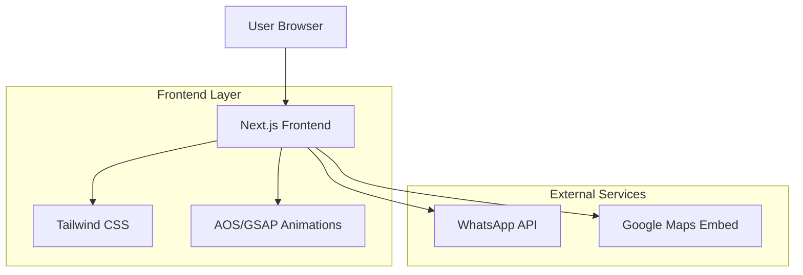

# Technical Architecture - Wedding Website

## 1. Architecture Design



## 2. Technology Description
- **Frontend**: Next.js@14 + React@18 + Tailwind CSS@3
- **Animations**: AOS (Animate On Scroll) + GSAP for advanced animations
- **Styling**: Tailwind CSS via CDN for rapid development
- **External APIs**: WhatsApp (wa.me links), Google Maps embed
- **Audio**: HTML5 Audio API with user interaction trigger

## 3. Route Definitions
| Route | Purpose |
|-------|---------|
| / | Welcome envelope page with interactive opening |
| /wedding | Main wedding website with all sections |

## 4. Core Components

### 4.1 Main Components
- **EnvelopeAnimation**: Interactive envelope with wax seal
- **HeroSection**: Full-screen hero with animated text
- **CalendarSection**: Interactive calendar grid with highlighted date
- **CountdownTimer**: Live countdown to wedding date
- **LocationMap**: Styled Google Maps embed
- **Timeline**: Vertical animated timeline
- **AudioPlayer**: Floating music player

### 4.2 Animation Sequence
```javascript
// Envelope opening flow
1. User clicks wax seal → CSS transform animation
2. Envelope opens → Fade transition
3. Background music starts (user gesture triggered)
4. Redirect to main wedding page
```

## 5. Key Features Implementation

### 5.1 Envelope Animation
- CSS 3D transforms for realistic envelope opening
- GSAP timeline for smooth sequence animation
- User interaction requirement for audio autoplay compliance

### 5.2 Responsive Design
- Mobile-first Tailwind utilities
- Flexible grid layouts (1 column mobile → multi-column desktop)
- Touch-optimized interactions

### 5.3 Performance Optimization
- Lazy loading for images and maps
- CDN-hosted libraries (Tailwind, AOS, GSAP)
- Optimized animation performance with CSS transforms

## 6. Browser Compatibility
- Modern browsers supporting CSS Grid and Flexbox
- Touch events for mobile envelope interaction
- HTML5 Audio API with user gesture requirement