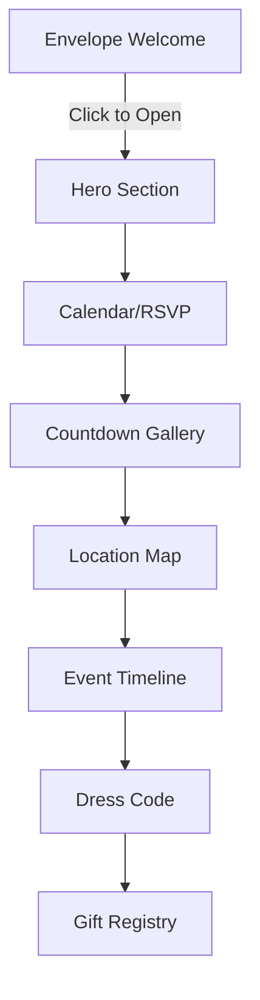

# Wedding Website - Greenery/Botanical Elegant Design

## Product Overview
A luxurious wedding invitation website with interactive envelope opening animation, countdown timer, and elegant botanical design. The website creates a "WOW effect" with smooth animations, responsive design, and sophisticated user experience for wedding guests.

## Core Features

### 2.1 User Roles
| Role | Registration Method | Core Permissions |
|------|---------------------|------------------|
| Guest | No registration required | View wedding details, RSVP via WhatsApp |

### 2.2 Feature Module
The wedding website consists of the following main pages:
1. **Welcome Envelope**: Interactive envelope with wax seal that opens to reveal the website
2. **Main Wedding Site**: Hero section, countdown, calendar, location, timeline, dress code, and gift registry

### 2.3 Page Details
| Page Name | Module Name | Feature description |
|-----------|-------------|---------------------|
| Welcome Envelope | Envelope Animation | Click to open envelope with CSS/JS animation, auto-play background music after interaction |
| Main Wedding Site | Hero Section | Full-screen couple photo with overlay, animated "¡Nos Casamos!" text, elegant typography |
| Main Wedding Site | Audio Player | Floating minimalist music player with play/pause controls |
| Main Wedding Site | Calendar | Interactive CSS Grid calendar highlighting February 7, 2026, with WhatsApp RSVP buttons |
| Main Wedding Site | Countdown | Live countdown to February 7, 2026 2:30 PM with masonry photo gallery |
| Main Wedding Site | Location | Google Maps iframe with styled filters, venue information and directions button |
| Main Wedding Site | Timeline | Vertical animated timeline with icons for each event time |
| Main Wedding Site | Dress Code | Visual dress code guidelines with prohibited colors highlighted |
| Main Wedding Site | Gift Registry | Subtle gift message with Amazon logo link |

## 3. Core Process
**Guest Flow:**
1. Land on envelope page with wax seal
2. Click to open envelope → music starts → transition to main site
3. Browse through sections: Hero → Calendar → Countdown → Location → Timeline → Dress Code → Gifts
4. RSVP via WhatsApp buttons or view location for directions

## 4. User Interface Design

### 4.1 Design Style
- **Primary Colors**: Olive Green (#556B2F), Sage Green (#87A96B)
- **Secondary Colors**: Cream/Beige (#F5F5DC), Soft Gold (#D4AF37)
- **Typography**: Playfair Display/Cinzel (serif) for headings, Lato (sans-serif) for body text
- **Button Style**: Outline style with elegant hover effects
- **Layout**: Card-based sections with generous spacing and smooth transitions
- **Icons**: Minimalist line icons for timeline events

### 4.2 Page Design Overview
| Page Name | Module Name | UI Elements |
|-----------|-------------|-------------|
| Welcome Envelope | Envelope | 3D envelope with wax seal animation, "V & S" initials on seal |
| Hero Section | Main Title | Full-screen image overlay, fade-in "¡Nos Casamos!" with elegant serif font |
| Calendar | Date Display | CSS Grid calendar with February 7, 2026 highlighted in gold |
| Countdown | Timer | Large elegant numbers (Days:Hours:Minutes:Seconds) with masonry photo layout |
| Location | Map | Styled Google Maps iframe with grayscale filter, venue card overlay |
| Timeline | Events | Vertical line with circular icons, animated appearance on scroll |

### 4.3 Responsiveness
- **Mobile-first design** with responsive breakpoints
- **Touch-optimized** interactions for envelope opening and navigation
- **Flexible grid layouts** that adapt from single column (mobile) to multi-column (desktop)
- **Optimized typography** scaling for readability across devices